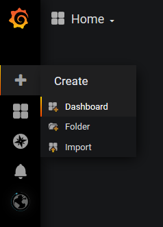
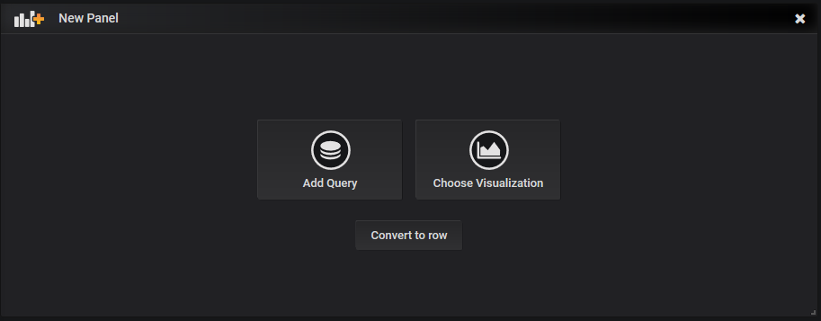
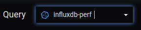
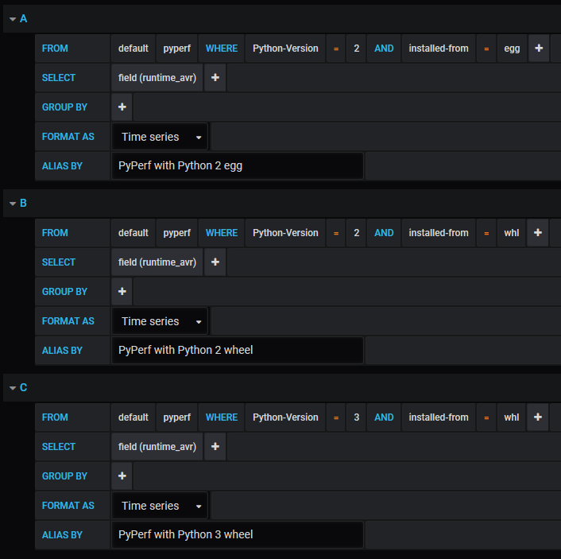
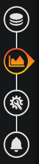
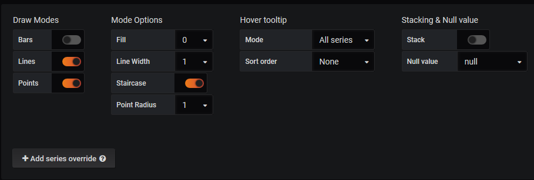
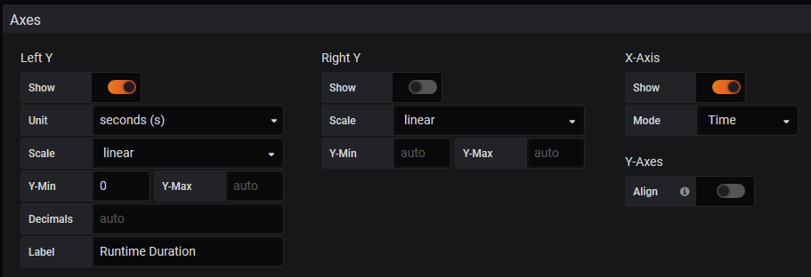
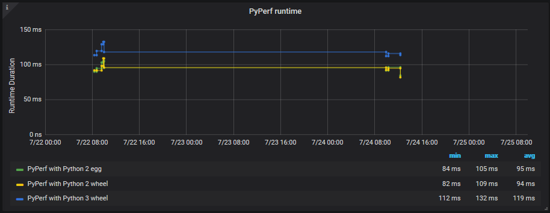

.. _`howto_visualize`:

=============================
HowTo: Visualize with Grafana
=============================

Now that you have collected and uploaded your data it is time to visualize it. For this
we recommend you to use Grafana, since it nicely works with the Influx DB we are supporting.

Creating a Dashboard
====================
To create a new dashboard for your measurements, hover over the plus in the top left corner and click
on :emphasis:`Dashboard`. After that choose :emphasis:`Add Query`.

Now you have a Dashboard with a Panel, where you can visualize your data.

For that choose your Influx database that contains your data as a source.

Now you can select the data from your database.
In this example our measurement is called :emphasis:`PyPerf` and we want to visualize the difference
of the runtime average of running it in Python 2 and Python 3 and the corresponding install option.

The queries for that would look like this:

Now that we chose the data to visualize, we will configure how it is displayed. Therefore click on
visualization.

At this point you have to think about what you want to say with the visualization of your data.
In our example we want to have the measuring points connected by lines.

.. note::
    Make sure the line thickness and the point radius is reasonable, since to high values can
    decrease the readability of your panel drastically.

.. note::
    When drawing lines consider the staircase option, since an increasing or decreasing line with no
    points on it implies, that the value is increasing/decreasing constantly.

We are almost done. Now we only need to configure the axes and the legend. Make sure to choose the
correct unit and scale for your axis.

.. note::
    We recommend to set Y-min always to 0, since a visualization not doing this still looks like
    it would be starting at 0, even though it does not. It also makes differences seem bigger
    than they really are.

Lastly you need to configure the legend of your panel and fill the general information like title
and description.

This now results in the following panel:

.. note::
    Choose a reasonable time range for your dashboard. When you are only measuring once a week, the
    option daily or weekly would not be intelligent, since not much data would be displayed.
